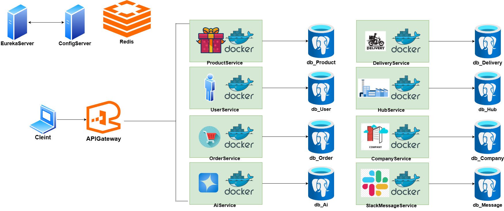
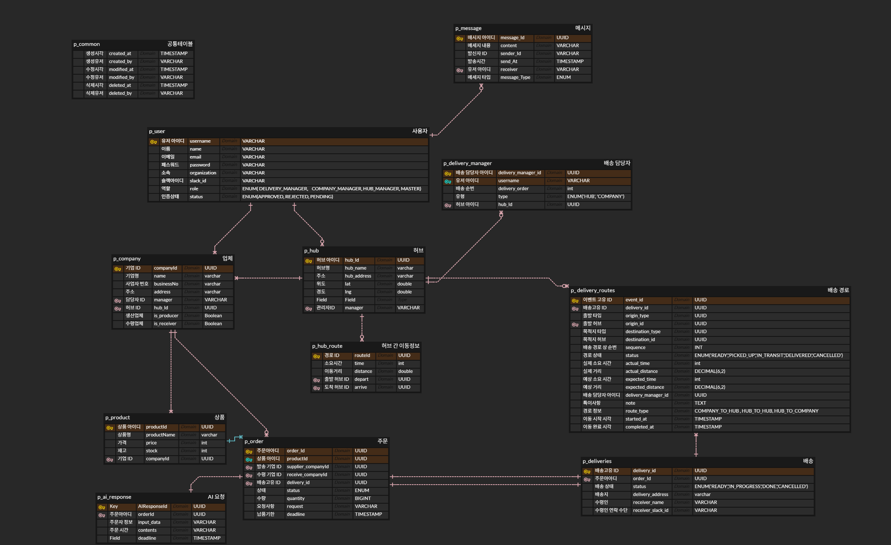

# PathFinder
<div>
  <h1>🚚 물류 배송 관리 플랫폼 PathFinder</h1>
  <h3>MSA 기반 전국 물류 허브 배송 관리 시스템</h3>
</div>

<br>

## 목차
- [1. 프로젝트 개요](#1-프로젝트-개요)
- [2. 프로젝트 관리](#2-프로젝트-관리)
- [3. 프로젝트 구상도](#3-프로젝트-구상도)
- [4. 기능 구현](#4-기능-구현)
- [5. 기술 문서](#5-기술-문서)
- [6. 트러블슈팅](#6-트러블슈팅)

<br>

---

## 1. 프로젝트 개요
전국 17개 물류 허브를 기반으로 한 **B2B 물류 관리 및 배송 플랫폼**으로,  
허브 간 배송 효율화와 경로 최적화를 목표로 설계된 **MSA(Microservices Architecture)** 기반 시스템입니다.

### ✨ 주요 기능
- MSA 구조 기반의 **독립적 서비스 운영**
- **JWT 인증** 기반 사용자 권한 관리
- **P2P + Hub-to-Hub Relay** 방식의 효율적인 배송 경로 관리
- **논리적 삭제(Soft Delete)** 및 **Audit 필드 관리**
- **FeignClient**를 통한 마이크로서비스 간 통신

### 🛠️ 개발 환경


### 👥 팀 구성
| 이름  | 담당 서비스                               |                                                                       Github                                                                       |
|-----|--------------------------------------|--------------|
| 김민식 | 허브(Hub), <br> 허브 간 이동 경로(HubRoute)   | <a href="https://github.com/minsik0"></a> |
| 도상원 | 배송(Delivery)                         | <a href="github.com/dark2138"></a> |
| 박래현 | Company, Product                     | <a href="https://github.com/Raebagi"></a> |
| 오상경 | 사용자(User),<br>배송담당자(DeliveryManager) | <a href="https://github.com/osk0521"></a> |
| 한규원 | 주문(Order), 메시지(Message)              | <a href="https://github.com/akaneblue"></a> |

---

## 2. 프로젝트 관리

### 📅 개발 기간
2025.10.31 ~ 2025.11.13

<details>
<summary><strong>협업 라이프사이클</strong></summary>

1. 브랜치 생성
2. 코드 작성
3. PR 생성
4. 리뷰 요청
5. `dev` → `main` Merge
</details>

<details>
<summary><strong>컨벤션</strong></summary>


- **Branch**
    - **전략**

      | Branch Type | Description |
            |-------------|-------------|
      | `dev`       | 주요 개발 branch, `main`으로 merge 전 거치는 branch |
      | `feature`   | 각자 개발할 branch, 기능 단위로 생성하기, 할 일 issue 등록 후 branch 생성 및 작업 |

    - **네이밍**
        - `{header}/#{issue number}`
        - 예) `feat/#1`

- **커밋 메시지 규칙**
    ```bash
    > type: 기능 요약 (: 뒤 한 칸 뛰고)

      - chore: 내부 파일 수정
      - feat: 새로운 기능 구현
      - add: feat 이외의 부수적인 코드 추가, 라이브러리 추가, 새로운 파일 생성 시
      - fix: 코드 수정, 버그, 오류 해결
      - del: 쓸모없는 코드 삭제
      - docs: README나 WIKI 등의 문서 개정
      - move: 프로젝트 내 파일이나 코드의 이동
      - rename: 파일 이름의 변경
      - merge: 다른 브랜치를 merge하는 경우
      - style: 코드가 아닌 스타일 변경을 하는 경우
      - init: Initial commit을 하는 경우
      - refactor: 로직은 변경 없는 클린 코드를 위한 코드 수정
      
      ex) feat: 게시글 목록 조회 API 구현
    ```

- **Issue**
    ```bash
    📱 Description
    <!-- 진행할 작업을 설명해주세요 -->
    
    📱 To-do
    <!-- 작업을 수행하기 위해 해야할 태스크를 작성해주세요 -->
    [ ] todo1
    
    📱 ETC
    <!-- 특이사항 및 예정 개발 일정을 작성해주세요 -->
    ```

- **PR**
    - **규칙**
        - 기능 branch 작업 완료 후 PR 보내기
        - PR 후 슬랙에 공유하기
        - 최소 1명 이상의 동의를 받으면 merge
        - review 반영 후, 본인이 merge

    - **Template**
      ```bash
      📒 Issue Number
      <!-- 작업한 이슈 번호를 명시해주세요 -->
      
      📒 Description
      <!-- 작업 내용에 대한 설명을 적어주세요 -->
      
      📒 Test Result
      <!-- local에서 postman으로 요청한 결과를 첨부합니다 -->
      
      📒 To Reviewer
      <!-- 리뷰 받고 싶은 포인트를 작성합니다 -->
      
      ```
</details>

<br>

## 3. 프로젝트 구상도
 이미지 삽입 예정
### 🛠️ 아키텍처
<p align="center">
  
</p>
### 🔗 ERD

ERD 이미지 삽입 예정

<p align="center">
  
</p>


## 4. 기능 구현
✨ 주요 서비스 구성

| 서비스                  | 역할                                  |
|----------------------| ----------------------------------- |
| **Gateway Service**  | 클라이언트 요청 라우팅 및 필터링                  |
| **Eureka Server**    | 서비스 디스커버리 및 등록 관리                   |
| **User Service**     | 회원가입, 로그인, 권한 승인 (JWT 기반)           |
| **Hub Service**      | 전국 허브 CRUD 및 캐싱 관리                  |
| **Hub Route Service** | 허브 간 경로 관리 (P2P + Hub-to-Hub Relay) |
| **Order Service**    | 주문 생성/취소, 배송 자동 생성 연동               |
| **Delivery Service** | 배송 상태 추적 및 경로 이력 관리                 |
| **Company Service**  | 업체 정보 및 허브 소속 관리                    |
| **Product Service**  | 상품 정보 CRUD                          |


🚚 허브 간 이동 방식
PathFinder는 P2P + Hub-to-Hub Relay 알고리즘을 적용합니다.
<li>200km 이하: 인접 허브 간 P2P 직접 배송</li>
<li>200km 초과: 중간 허브를 통한 Relay 배송 경로 계산</li>
<li>허브 간 최단 거리 계산 및 경유 허브 자동 결정</li>
<li>Redis 캐싱을 통한 경로 조회 성능 최적화</li>

🗂️ 주요 도메인 설계

| 도메인              | 설명                                  |
|----------------------| ----------------------------------- |
| **Hub**          | 허브명, 주소, 좌표 정보                  |
| **Route**        | 허브 간 경로 및 거리                  |
| **User**         | 권한(Role) 기반 접근 제어                  |
| **Company**      | 업체 등록 및 소속 허브 관리                  |
| **Product**      | 상품 및 재고 관리                  
| **Order**        | 주문 요청, 상태 변경, 배송 연동                  |
| **Delivery**     | 배송 추적, 진행 단계 관리                  |
| **SlackMessage** | 알림 메시지 로그 관리                  |

🔐 사용자 권한 구조

| 역할                  | 설명                                  |
|----------------------| ----------------------------------- |
| **MASTER**     | 전체 관리 권한                  |
| **HUB_MANAGER**      | 허브 및 배송 관리                  |
| **DELIVERY_MANAGER** | 자신의 배송만 접근 가능                  |
| **COMPANY_MANAGER**  | 업체별 상품 및 주문 관리                  |

## 5. 기술 문서

### 📄 Swagger
<details>
    <summary><strong>Swagger</strong></summary>
    
</details>

### 🔗 디렉토리 구조
<details>
    <summary><strong>디렉토리 구조</strong></summary>

```
    com.pathfinder
    ├─ gateway-service
    │  ├─ config
    │  │   ├─ GatewayConfig.java
    │  │   ├─ RedisConfig.java
    │  │   └─ SecurityConfig.java
    │  ├─ security
    │  │   ├─ JwtAuthenticationFilter.java
    │  │   └─ JwtUtil.java
    │  ├─ service
    │  │   └─ UserCacheService.java
    │  └─ dto
    │      └─ UserResponseDto.java
    
    ├─ eureka-server
    │  └─ EurekaApplication.java
    
    ├─ config-server
    │  ├─ ConfigApplication.java
    │  └─ resources/config-repository/
    │      ├─ user-service-dev.yml
    │      ├─ order-service-dev.yml
    │      ├─ delivery-service-dev.yml
    │      ├─ hub-service-dev.yml
    │      ├─ message-service-dev.yml
    │      └─ gateway-service-dev.yml
    
    ├─ user-service
    │  ├─ application
    │  │   ├─ UserServiceV1.java
    │  │   ├─ UserDetailsServiceImpl.java
    │  │   ├─ dto/request/
    │  │   ├─ exception/
    │  │   └─ response/
    │  ├─ domain
    │  │   ├─ entity/
    │  │   ├─ enums/
    │  │   └─ repository/
    │  ├─ infrastructure
    │  │   ├─ client/
    │  │   ├─ config/
    │  │   │   ├─ redis/
    │  │   │   └─ security/
    │  │   └─ repository/
    │  ├─ jwt/
    │  └─ presentation
    │      ├─ controller/
    │      └─ dto/response/
    
    ├─ delivery-manager-service
    │  ├─ application/
    │  │   ├─ DeliveryManagerServiceV1.java
    │  │   ├─ DeliveryManagerInternalServiceV1.java
    │  │   └─ exception/
    │  ├─ domain/
    │  │   ├─ entity/
    │  │   ├─ enums/
    │  │   └─ repository/
    │  ├─ infrastructure/
    │  │   ├─ cache/
    │  │   ├─ client/
    │  │   ├─ config/
    │  │   │   └─ security/
    │  │   └─ repository/
    │  └─ presentation/
    │      ├─ controller/
    │      └─ dto/response/
    
    ├─ hub-service
    │  ├─ application/
    │  │   ├─ HubServiceV1.java
    │  │   ├─ HubRouteService.java
    │  │   └─ HubManagerService.java
    │  ├─ domain/
    │  │   ├─ model/
    │  │   ├─ enums/
    │  │   └─ repository/
    │  ├─ infrastructure/
    │  │   ├─ client/
    │  │   ├─ config/
    │  │   └─ cache/
    │  └─ presentation/
    │      ├─ controller/
    │      ├─ advice/
    │      └─ dto/
    
    ├─ delivery-service
    │  ├─ application/
    │  │   ├─ command/
    │  │   │   └─ service/
    │  │   ├─ query/
    │  │   │   └─ service/
    │  │   ├─ outbox/
    │  │   ├─ dto/
    │  │   └─ exception/
    │  ├─ domain/
    │  │   ├─ entity/
    │  │   ├─ enums/
    │  │   ├─ repository/
    │  │   ├─ service/
    │  │   └─ value/
    │  ├─ infrastructure/
    │  │   ├─ external/
    │  │   │   ├─ client/
    │  │   │   ├─ fallback/
    │  │   │   ├─ dto/
    │  │   │   └─ security/
    │  │   ├─ config/
    │  │   ├─ messaging/
    │  │   └─ repository/
    │  └─ presentation/
    │      └─ controller/
    
    ├─ order-service
    │  ├─ application/
    │  │   ├─ OrderServiceV1.java
    │  │   ├─ dto/
    │  │   └─ exception/
    │  ├─ domain/
    │  │   ├─ entity/
    │  │   ├─ enums/
    │  │   └─ repository/
    │  ├─ infrastructure/
    │  │   ├─ global/
    │  │   │   ├─ client/
    │  │   │   ├─ fallback/
    │  │   │   ├─ dto/
    │  │   │   └─ security/
    │  │   ├─ config/
    │  │   └─ repository/
    │  └─ presentation/
    │      ├─ controller/
    │      └─ dto/
    
    ├─ product-service
    │  ├─ application/
    │  │   ├─ ProductService.java
    │  │   ├─ dto/
    │  │   └─ exception/
    │  ├─ domain/
    │  │   └─ entity/
    │  ├─ infrastructure/
    │  │   ├─ global/
    │  │   │   ├─ client/
    │  │   │   ├─ fallback/
    │  │   │   ├─ dto/
    │  │   │   └─ security/
    │  │   ├─ config/
    │  │   └─ repository/
    │  └─ presentation/
    │      ├─ controller/
    │      └─ dto/response/
    
    ├─ company-service
    │  ├─ application/
    │  │   ├─ CompanyService.java
    │  │   ├─ dto/
    │  │   └─ exception/
    │  ├─ domain/
    │  │   └─ entity/
    │  ├─ infrastructure/
    │  │   ├─ config/
    │  │   └─ repository/
    │  └─ presentation/
    │      ├─ controller/
    │      └─ dto/response/
    
    ├─ message-service
    │  ├─ application/
    │  │   └─ MessageService.java
    │  ├─ domain/
    │  │   ├─ entity/
    │  │   ├─ enums/
    │  │   └─ repository/
    │  ├─ infrastructure/
    │  │   ├─ config/
    │  │   ├─ global/
    │  │   │   └─ security/
    │  │   └─ repository/
    │  └─ presentation/
    │      ├─ controller/
    │      └─ dto/
    
    └─ docker/
       ├─ docker-compose.yml
       ├─ docker-compose.infrastructure.yml
       └─ init-db.sql

```
</details>
---

## 6. 트러블슈팅
### 1️⃣ User Service 인증 및 Gateway 헤더 전달 구조 개선
**문제 요약**  
  로그인 이후 각 서비스에서 인증이 일관되지 않거나, 게이트웨이를 통해 전달된 요청이 JWT 인증 정보를 유지하지 못해 접근 권한 검증이 실패하는 문제가 발생했다.

**원인 분석**
  - User 서비스에서 발급한 JWT를 각 서비스가 개별적으로 검증  
  - Gateway가 단순 프록시 역할만 수행하여 인증 결과를 공유하지 않음  
  - 서비스 간 인증 필터 중복으로 유지보수가 어려움  

**해결 방법**
  - **인증은 User 서비스에서 수행, 검증은 Gateway에서만 수행**  
  - Gateway의 `JwtAuthenticationFilter`에서 토큰을 검증한 뒤 사용자 정보(`username`, `role`)를 헤더에 저장  
  - 이후 모든 서비스는 Gateway가 전달하는 헤더(`X-User-Username`, `X-User-Role`)를 이용하여 인증 및 권한 처리  

**핵심 코드 (JwtAuthenticationFilter)**
```java
ServerWebExchange modifiedExchange = rebuildExchange(exchange, bytes)
        .mutate()
        .request(builder -> builder
                .header("X-User-Username", username)
                .header("X-User-Role", role))
        .build();
return chain.filter(modifiedExchange);
```
**추가 개선**
  /api/v1/auth/**, /v3/api-docs 등 공개 경로는 JWT 검증을 건너뛰도록 PUBLIC_PATHS 지정
  토큰이 유효하지 않거나 누락된 경우 401 Unauthorized 반환

**결과**
  인증 책임이 명확하게 분리됨 (User → 발급 / Gateway → 검증 및 전달)
  서비스 간 인증 중복 제거
  API 요청마다 공통 헤더 기반으로 일관된 인증 상태 유지

### 2️⃣ 공통 모듈(JitPack) 관리 및 버전 충돌 해결
**문제 요약**  
  SwaggerConfig, BaseEntity, GlobalExceptionHandler 등 공통 모듈을 각 서비스가 중복 보유하여 관리가 어려움.

**해결 방법**
  공통 코드(pathfinder-common)를 별도 모듈로 분리
  JitPack을 통해 배포 후 각 서비스 build.gradle에 의존성 추가

**결과**
  공통 유틸, 예외 처리, Swagger 설정 재사용
  서비스별 중복 코드 제거 및 관리 용이

### 3️⃣ 허브 거리 계산 및 캐싱 구조 개선

**문제 요약**  
  허브 간 거리 계산 시 불필요한 DB 조회와 매핑 오류로 인해 성능 저하 및 잘못된 배송 경로가 발생했다.

**원인 분석**
  허브 ID 간 매핑 로직 누락
  동일 경로 요청에도 매번 거리 계산 수행

**해결 방법**
  허브 경로 정보를 Redis 캐싱 구조로 변경
  허브 간 ID 매핑 로직 보완
  허브 간 이동은 P2P + Hub to Hub Relay 방식으로 처리

### 4️⃣ 허브 배송 담당자 관리 로직 개선
**문제 요약**  
  허브 간 배송 담당자(hub-to-hub courier)의 소속 허브 정보(hubId)가 불명확하여 배차 오류 발생.

**해결 방법**
  중앙 허브 하나를 지정하고, 해당 허브의 담당 매니저를 MASTER 등급으로 지정
  허브 간 이동 담당자는 항상 중앙 허브에 소속되도록 정책화

**결과**
  허브 간 배송 책임 및 소속 관계 명확화
  중앙 집중형 허브 관리 구조 확립

